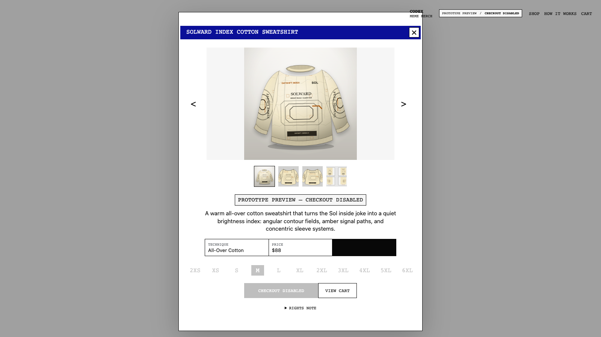
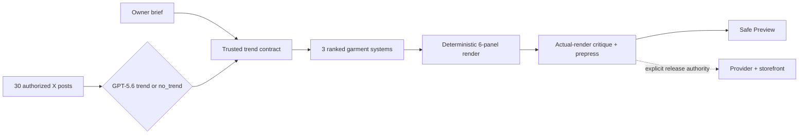

# Codex Merch

> An open-source, hackable trend-signal → real-merch pipeline.

Codex Merch turns a trusted cultural signal into an original, production-ready
garment—not just an image. GPT-5.6 supplies bounded trend and visual judgment;
deterministic software owns provenance, rights gates, six-panel rendering,
prepress, artifact hashes, and release safety. A human keeps the keys to every
external or commercial action.

[Open the live Build Week storefront](https://codex-merch.vercel.app)
· [Watch the local jury master](video/out/codex-merch-signal-to-product-1080p.mp4)
· [Read the submission guide](docs/build-week/README.md)
· [Inspect the architecture](docs/build-week/architecture.md)

**Current Vercel production:** [`codex-merch.vercel.app`](https://codex-merch.vercel.app).
The storefront is free to browse and test. Its only real checkout is a separate,
private-code path reserved for OpenAI Build Week judges; no purchase is required.



## Why this is different

Most generative-fashion demos stop at a picture. Codex Merch preserves the
whole path from signal to physical product as an inspectable, replaceable
system:



- Open: prompts, strict schemas, state transitions, renderer, tests, and
  adapters live in the repository.
- Hackable: swap the signal source, decision contract, physical product, or
  provider without replacing the entire pipeline.
- Truthful: owner-supplied ideas, synthetic fixtures, and live signals retain
  different provenance and permissions.
- Production-intent: the output is a complete provider-sized garment system
  with repeatable files and hashes.
- Fail-closed: `no_trend` is a valid outcome, Preview cannot charge or fulfill,
  and the jury-only production path requires explicit human authority and live
  readiness checks.

## Judge path — five minutes

1. Open the [live Build Week storefront](https://codex-merch.vercel.app); no
   account, payment, or API key is required to browse and evaluate it.
2. Select **Solward Index Cotton Sweatshirt** and inspect its front, back,
   pattern system, production technique, and rights note.
3. Open **How it works** and follow the five-stage signal → direction → render
   → proof → release loop.
4. Inspect the [sanitized evidence bundle](docs/build-week/evidence/README.md)
   for model IDs, prompt/schema hashes, decisions, critic results, prepress
   checks, and artifact hashes—without raw private post text.
5. Run the credential-free decision path locally:

   ```bash
   npm ci
   npm run merch:weekly:demo -- --dry-run --week 2026-W30
   ```

The canonical Vercel deployment demonstrates the complete creative pipeline and
is free to browse, install, test, and evaluate. Commerce is an optional proof,
not part of the required judge path. Only the signed **Codex Rate Reset Long
Sleeve Tee** can enter live Stripe Checkout; delivery is limited to Switzerland
and the United States, checkout requires a private OpenAI Build Week jury code,
and access expires automatically when judging ends. Printful orders remain
unconfirmed for human review before manufacturing.

This is a fan-made project and its products are not official OpenAI merchandise;
it is not affiliated with, sponsored by, or endorsed by OpenAI.

## Run locally

Prerequisites: Git and Node.js 22 or 24. Node 22 is recorded in `.nvmrc`.

```bash
git clone https://github.com/self-tech-labs/codex-merch.git
cd codex-merch
nvm use
npm ci
cp .env.example .env.local
npm run dev
```

The default configuration is safe: `STOREFRONT_MODE=preview`, checkout is off,
and provider credentials are empty. Visit `http://localhost:5173`.

Run the full repository gate before opening a pull request:

```bash
npm run submission:verify
npm run test:e2e
```

`submission:verify` validates the catalog, runs unit tests, typecheck, lint,
and a production build, then checks submission files, fixtures, secrets, and
Git provenance. Database integration coverage is additionally enabled when
`TEST_DATABASE_URL` is set.

## Try the two inputs

### 1. Direct owner premise

This is the shortest Build Week path. It uses no X data and claims no discovery
provenance.

```bash
# Requires OPENAI_API_KEY; plans three GPT-5.6 directions without writing files
npm run merch:trend-preview -- --trend "Compiler Summer" \
  --context "A team joke about fast builds arriving with warm weather" --dry-run

# Renders, critiques, prepress-checks, and stores a non-sellable Preview candidate
npm run merch:trend-preview -- --trend "The Sol Shines"
```

### 2. Weekly signal discovery

The credential-free fixture is synthetic and explicitly marked as such. It is
useful for understanding the state machine, not for claiming a live trend.

```bash
# Synthetic decision-only replay; no catalog or asset mutation
npm run merch:weekly:demo -- --dry-run --week 2026-W30

# Live X + GPT-5.6 decision path; requires local credentials
npm run merch:weekly -- --list-id 2067819170989854863 --count 30 --dry-run

# Inspect an existing run and its release plan without external mutation
npm run merch:weekly:status -- --week 2026-W30
npm run merch:weekly:release -- --week 2026-W30
```

The sample input lives at
[`fixtures/x/codex-team-meme-30.synthetic.json`](fixtures/x/codex-team-meme-30.synthetic.json).
A non-dry synthetic prepare writes local assets and is intentionally
non-releasable; use a disposable checkout for that rehearsal. Never add
`--release` while following the judge path.

## Where to hack

| Seam | Start here | Example extension |
| --- | --- | --- |
| Signal source | [`scripts/adapters`](scripts/adapters), [`signals.mjs`](scripts/services/signals.mjs) | Community feed, search data, retail sell-through, internal trend desk |
| Trend contract | [`weekly-trend.md`](scripts/prompts/weekly-trend.md), [`trend.schema.json`](merch/weekly/schemas/trend.schema.json) | Different recurrence, evidence, novelty, or rights policy |
| Creative system | [`weekly-art-director.md`](scripts/prompts/weekly-art-director.md), [`weekly-product.mjs`](scripts/services/weekly-product.mjs) | New aesthetic grammar, placement system, or garment |
| Physical templates | [`base-products.json`](merch/base-products.json), [`customization-techniques.json`](merch/customization-techniques.json) | Bags, knitwear, accessories, alternate print methods |
| Release target | [`production-providers.mjs`](scripts/services/production-providers.mjs), [`app`](app) | Another provider, internal PLM, wholesale review, existing commerce stack |

## Commercial thesis

The prototype is small; the underlying industry question is not. Fashion
groups invest heavily in shortening signal-to-sample cycles and creating more
specific products without losing brand, rights, or production control. This
repository is an open R&D surface for that problem.

- High-velocity retailers such as Zara and Shein are relevant examples for
  speed: qualify a signal, generate a coherent product system, and test it in
  one traceable run.
- Luxury portfolios such as Richemont and LVMH are relevant examples for
  controlled experimentation: compare models, sources, formats, and approval
  rules as separate components rather than one opaque generator.
- Brands of any size could turn community, regional, or customer-segment
  signals into smaller capsules and hyper-personalized product concepts.

These companies are market examples only. No affiliation, endorsement,
customer relationship, or use of proprietary data is claimed.

## Model, software, and human roles

| Stage | GPT-5.6 judgment | Deterministic authority |
| --- | --- | --- |
| Trend | Return one recurring trend or `no_trend` under a strict schema | Require exactly 30 normalized posts, evidence spread, novelty, safe original language, and low rights risk |
| Direction | Return exactly three strongest-first, panel-aware garment systems | Enforce supported primitives, panel completeness, copy rules, and production constraints without re-ranking taste |
| Review | Inspect the actual rendered panels and mockups | Block concrete rights/production defects; verify prepress, immutable hashes, and repository checks |

The OpenAI Responses API is called with strict Structured Outputs and
`store: false`. Raw X content is treated as untrusted research input and never
enters public product copy, artwork, screenshots, or logs.

## Codex collaboration and Build Week delta

This repository existed before Build Week. During the event, Codex collaborated
on the end-to-end weekly extension: repository audit, state machine, prompts and
schemas, deterministic rendering, adversarial tests, safe retry/release design,
documentation, and the repository-owned `codex-merch-weekly` skill. Codex
accelerated the cross-cutting engineering work; GPT-5.6 performs bounded runtime
judgments.

The key decisions remained human-held: audience, signal source, garment medium,
safety posture, artistic acceptance, rights clearance, provider credentials,
and release authority. The exact pre-event baseline and judged delta are in
[`docs/build-week/provenance-delta.md`](docs/build-week/provenance-delta.md).

## Repository map

```text
app/                    React Router storefront and Preview explainer
merch/                  Catalog, product contracts, and garment configuration
scripts/                CLI orchestration, adapters, prompts, and tests
fixtures/               Explicitly synthetic credential-free replay data
assets/                 Artwork, production panels, and storefront mockups
docs/build-week/        Jury guide, architecture, evidence, and submission record
.codex/skills/          Repository-owned Codex operating workflow
```

## Safety and production boundary

Preview products are non-purchasable. Automated candidates remain hidden until
their manifest status is `published`, and checkout verifies product and variant
readiness again on the server. A production release requires the literal
`--release` flag, `MERCH_WEEKLY_RELEASE_ENABLED=true`, unchanged approved hashes,
valid provider and commerce configuration, and `PRINTFUL_AUTO_CONFIRM=false`.
The weekly release never creates a customer order.

Real Build Week purchases add another independent boundary:
`JURY_SALES_ENABLED=true`, an unexpired `JURY_SALES_END_AT`, and a private
`JURY_ACCESS_CODE` of at least 16 characters. The server verifies that code
before creating an order record or Stripe Checkout Session. Readiness reports
the jury-only audience and expiry without exposing the code.

The canonical [Vercel production deployment](https://codex-merch.vercel.app)
was last verified on 2026-07-21 with live Stripe, Printful, and database
readiness; CH/US shipping; code-protected jury access; automatic expiry; and
`PRINTFUL_AUTO_CONFIRM=false`.

Operational details live in the [production deployment guide](docs/production-deployment.md)
and [runbook](docs/production-runbook.md). Build Week architecture, evidence,
judge access, rights, and the owner checklist are indexed in
[`docs/build-week/README.md`](docs/build-week/README.md).

## Contributing, security, and license

Contributions are welcome; start with [`CONTRIBUTING.md`](CONTRIBUTING.md).
Please report vulnerabilities privately using [`SECURITY.md`](SECURITY.md).

The pipeline source code is MIT-licensed. Merch artwork, mockups, trademarks,
third-party reference screenshots, and provider templates are excluded from
that grant; see [`ASSET-LICENSE.md`](ASSET-LICENSE.md) before redistributing a
fork.
