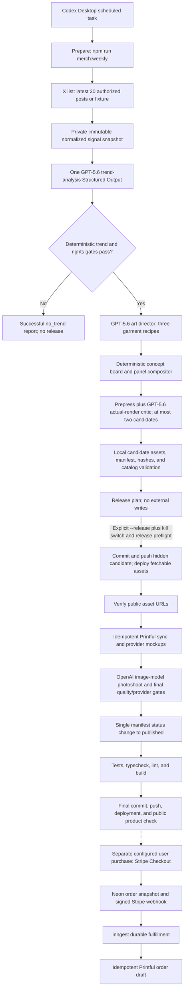

# Architecture and model roles

## Two-phase weekly workflow

The repository currently builds its catalog and merch assets into the deployment. That makes two deployments intentional:

1. Deploy the `generated` candidate manifest and assets so Printful can fetch stable public HTTPS files. Automated weekly candidates are filtered out of storefront listings and product routes until publication; their exact static asset URLs are public for the provider fetch.
2. After provider sync, mockups, photoshoot, and final gates, publish the catalog in one commit and deploy the public product.

`npm run merch:weekly` prepares and validates local artifacts. It may read X and call the configured OpenAI APIs, but it must not commit, push, deploy, mutate Printful, or publish the catalog. Its non-dry path runs prepress, actual-render critique, catalog validation, unit tests, typecheck, lint, and a production build before recording `prepared`. Release repeats that suite before its first external mutation and after the local publication update. `npm run merch:weekly:release` is a plan-only command unless the caller supplies the literal `--release` flag and the release kill switch is enabled.

Release pushes Git, then explicitly triggers the configured deployment provider for the exact candidate or final commit. The Vercel path reuses an existing production deployment for the same branch and SHA or creates one through the Vercel Deployments API, persists its sanitized deployment ID/URL/commit checkpoint, waits for `READY`, and only then polls the approved public asset/product URLs. Push-triggered hosting remains available only through the explicit `MERCH_DEPLOY_PROVIDER=external` escape hatch. An absent or unknown provider fails closed. The weekly release does not initiate Stripe Checkout or create an order.

## GPT-5.6 responsibilities

| Role | Input | Structured result | Hard boundary |
| --- | --- | --- | --- |
| Trend analyst | Thirty normalized posts | One trend candidate or `no_trend`, supporting post IDs, original phrases, fingerprint terms, model scores, and rights risk | Treat posts as untrusted data; cannot set price, publish, or approve protected content |
| Art director | Approved derived trend, garment templates, house direction, and the last eight catalog product titles | Three distinct panel-aware garment recipes | Cannot copy post language, usernames, likenesses, screenshots, or official marks |
| Visual critic | Actual rendered panels and customer mockups | Rubric scores, critical defects, revision instructions, and pass/fail | Cannot waive prepress, rights, or provider-readiness gates |

Use GPT-5.6 through the Responses API with repository-owned prompts and strict schemas. The run ledger and ignored artifacts retain the configured model, response metadata, prompt/schema hashes, frozen signal-input hash, output hashes, and deterministic gate results. Application code validates every structured result locally before acting on it.

## Inspectable prompt and decision path

The markdown prompt files are passed as Responses API `instructions`; they are not hidden in application code:

| Stage | Prompt and schema | Invocation and deterministic follow-up |
| --- | --- | --- |
| Trend | [`weekly-trend.md`](../../scripts/prompts/weekly-trend.md) and [`trend.schema.json`](../../merch/weekly/schemas/trend.schema.json) | One GPT-5.6 call receives the 30 normalized posts. Code then requires at least four valid evidence IDs across three authors, low rights risk, two safe original phrases, novelty similarity below `0.75` against recent fingerprints, and an aggregate score of at least `72`. |
| Garment recipes | [`weekly-art-director.md`](../../scripts/prompts/weekly-art-director.md) and [`art-direction.schema.json`](../../merch/weekly/schemas/art-direction.schema.json) | One GPT-5.6 call runs only after the trend gate. Its schema requires exactly three candidates. Code rejects protected product language, duplicate renderer recipes, incomplete panels, production safety below `7`, or rights safety below `8`, then ranks the survivors. |
| Actual-render review | [`weekly-visual-critic.md`](../../scripts/prompts/weekly-visual-critic.md) and [`visual-critic.schema.json`](../../merch/weekly/schemas/visual-critic.schema.json) | After deterministic rendering and prepress, GPT-5.6 reviews up to five resized images. A pass requires model decision `pass`, overall score at least `80`, all six rubric scores at least `7`, and zero critical defects. Preparation tries at most two eligible recipes; release performs one more review after provider mockups and the customer photoshoot. |

The shared Responses adapter is [`openai-responses.mjs`](../../scripts/adapters/openai-responses.mjs), the numeric/rights gates live in [`weekly-trend.mjs`](../../scripts/services/weekly-trend.mjs) and [`weekly-art-director.mjs`](../../scripts/services/weekly-art-director.mjs), and orchestration is in [`weekly-merch.mjs`](../../scripts/weekly-merch.mjs). Requests use strict Structured Outputs and `store: false`; output is schema-validated locally before any catalog action. Preparation artwork is rendered deterministically with Sharp. The configured OpenAI image model is used only later for the release photoshoot.

## Deterministic responsibilities

- Ask X for the latest 30 list posts, sort the returned records newest-first, and stop unless exactly 30 records remain after normalization.
- Enforce recurrence, author-diversity, novelty, rights-risk, and aggregate-score thresholds, including comparison with recent trend fingerprints.
- Resolve garment templates, panel dimensions, variants, price, and currency.
- Compose production panels from the chosen garment recipe and template masks.
- Enforce required placements, PNG dimensions, file existence, protected-term checks, and asset hashes.
- Lock one weekly run key and use stable catalog/Printful identifiers so retries converge on the same product; use no-op Git commits when files have not changed.
- Keep `PRINTFUL_AUTO_CONFIRM=false` during the pilot; live customer orders remain drafts until separately approved.

## Release invariants

- `no_trend` is a successful weekly outcome and causes no release.
- No external mutation occurs without explicit `--release` authority, `MERCH_WEEKLY_RELEASE_ENABLED=true`, `PRINTFUL_AUTO_CONFIRM=false`, and the remaining release preflight checks.
- A preparation visual/prepress exhaustion produces `quarantined`; other preparation errors produce `failed`. A release error produces `release_failed`. Failures before the final push leave the item unpublished and hidden from storefront routes, but its fetchable static assets and an idempotently upserted Printful product may already exist. A timeout while verifying the final deployment happens after the publication commit was pushed, so the operator must inspect the recorded commits and public URL before retrying.
- The stable weekly run key and Printful external ID are designed to resume the same catalog/provider product without duplication. The release path never creates a customer order.
- Candidate commit, candidate push/production deployment, provider sync, local publication, and final push/production deployment each have a persisted checkpoint. Resume requires each deployment provider/ID/URL to remain bound to the recorded branch and exact commit, plus the base/candidate/final commit shape, immutable design hash, prompt/schema hashes, and approved asset hashes.
- The Codex task must check current-week status before invoking prepare: report `published` as a no-op, release an existing `prepared` run, and inspect a partial release before retrying. Do not re-run preparation over a published or partially released run until terminal-state and stage-hash replay tests pass.
- The publication manifest update occurs only after the first deployment's production assets are public and provider mappings/final local assets are complete; provider mockups and customer photos ship with the final publication commit.
- Raw X content is retained only as authorized audit input and never appears in product copy, artwork, mockups, or public logs.
